# transcript_task — Visual QA Report

**Date:** 2026-09-25
**Scope:** FastAPI backend Swagger docs (`http://127.0.0.1:8000/docs`) and Streamlit frontend (`http://127.0.0.1:8501`)
**Method:** Both services were started locally per the setup instructions and driven with a real Chromium browser (Playwright, since no interactive Chrome/computer-use tool was connected to this session) to click through the actual rendered UI — not just source inspection. All screenshots below are real captures from this session.
**Test fixtures used:** `tests/fixtures/audio/fleurs_row00871.wav` (~4s) and `tests/fixtures/audio/fleurs_row00099.opus` (~37s).

---

## Part 1 — API docs (`/docs`)

### Top-level description

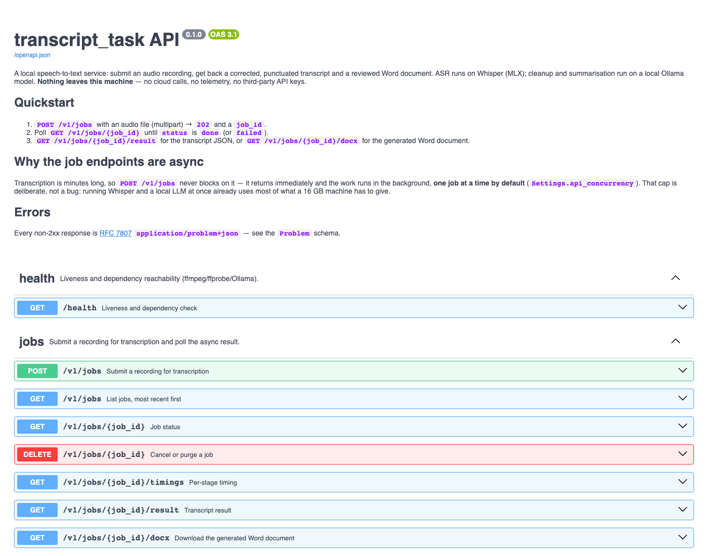

The description renders cleanly as Markdown: bold text, inline code, and the RFC 7807 link all display correctly. As a newcomer reading top to bottom:

- **Quickstart** (3 numbered steps: POST → poll → fetch result/docx) is exactly what a first-time integrator needs and is the first thing after the intro paragraph — good ordering.
- **"Why the job endpoints are async"** proactively answers "why doesn't this just return the transcript?" before the reader has to wonder, and explains the `api_concurrency=1` default as a deliberate resource tradeoff rather than a limitation. This is unusually good API-docs writing.
- **"Nothing leaves this machine"** (bold, in the first paragraph) clearly states the local-only/privacy angle right up front.
- **Errors** section correctly points to RFC 7807 / `application/problem+json` and the shared `Problem` schema.

### Tag grouping

Tags are `health`, `jobs`, `config`, `models`, `benchmark` — five clear, single-purpose groups, and every route sits under the tag you'd expect (e.g., `/v1/jobs/*` all under `jobs`, `/v1/config` GET+PATCH together under `config`). No routes are miscategorized or left untagged.

One rough edge: the `benchmark` tag's description reads *"Trigger an evaluation run against FLEURS/Common Voice and fetch its results — see PLAN.md's Phase 6."* `PLAN.md` is a file in the project repo, not something an API consumer reading `/docs` in a browser has access to. It reads as an internal dev note that leaked into public-facing documentation.

### Route-by-route review (5 endpoints expanded)

**`POST /v1/jobs`** (jobs) — Description is clear about the `refine=true/false` behavior and cross-references `GET /v1/config` for accepted extensions/size limits rather than hardcoding them — good practice, explicitly flagged in its own text as intentional ("since they're config, not a fixed constant, this description could drift out of sync with..." — actually a nice bit of self-aware documentation). However, see **Bug 1** below: the 400 and 413 example response bodies are wrong.

**`GET /v1/jobs/{job_id}`** (jobs) — "Poll this until `status` is a terminal value (`done`, `failed`, `canceled`)" with all five intermediate stage names listed inline. Very clear. Its 404 example is correct (see Bug 1 — this is the one endpoint where the shared example actually matches the status code).

**`GET /v1/jobs/{job_id}/docx`** (jobs) — Description explains the `refine_rejected` edge case (doc is still generated even if the LLM refine pass was rejected by "the quality guard") — a detail a newcomer would otherwise be surprised by. See **Bug 2** below: the 200 response example is actively misleading.

**`DELETE /v1/jobs/{job_id}`** (jobs) — the best-written block in the whole spec:

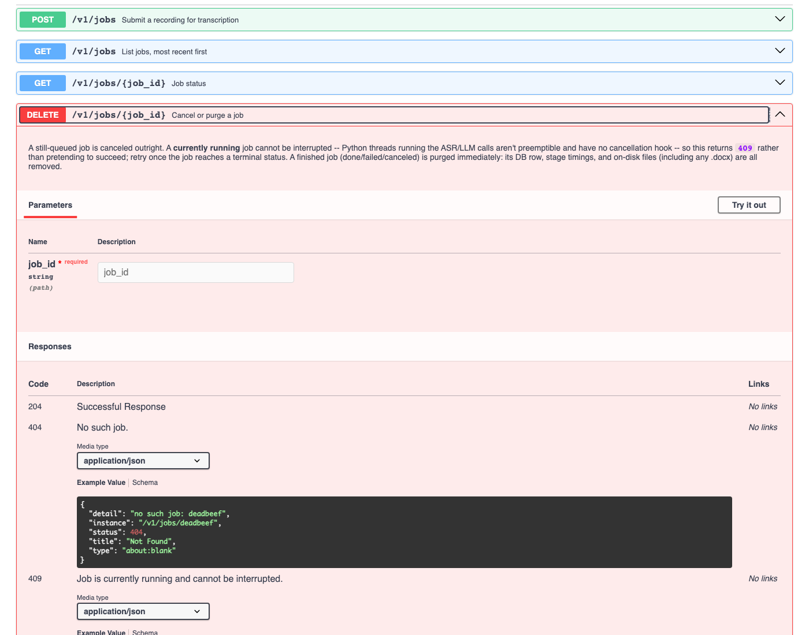

It explains *why* a running job returns `409` instead of being force-cancelled ("Python threads running the ASR/LLM calls aren't preemptible and have no cancellation hook"), and that a finished job is purged immediately (DB row, timings, and any `.docx` — all gone). This is exactly the kind of context a consumer needs before they build retry logic around this endpoint.

**`GET /v1/config`** — Describes the "what every *new* job will run under" vs. "a job already running keeps whatever config was in effect" distinction, which matters once you've read the `PATCH /v1/config` sibling route.

### "Try it out" — real data

**`GET /health`**:

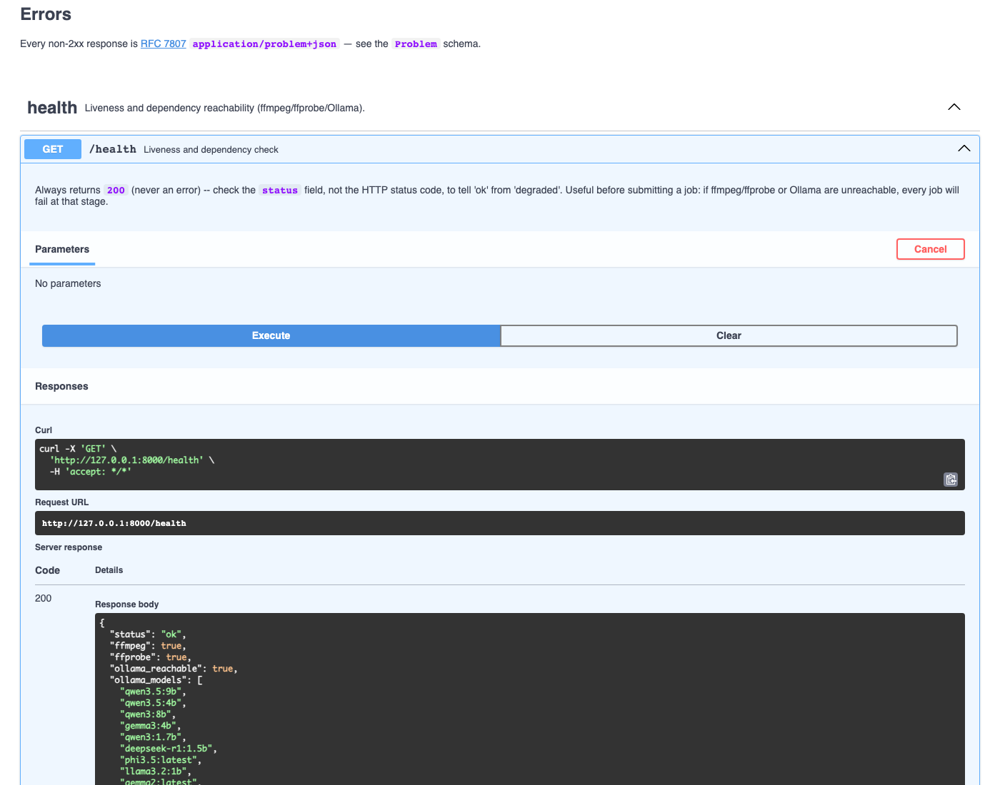

Returns real, live data: `ffmpeg`/`ffprobe` both `true`, `ollama_reachable: true`, and the full list of locally installed Ollama models. Matches what `curl http://127.0.0.1:8000/health` returned directly. The endpoint description itself is a good piece of writing too: *"Always returns 200 (never an error) — check the `status` field, not the HTTP status code."*

**`GET /v1/config`**:

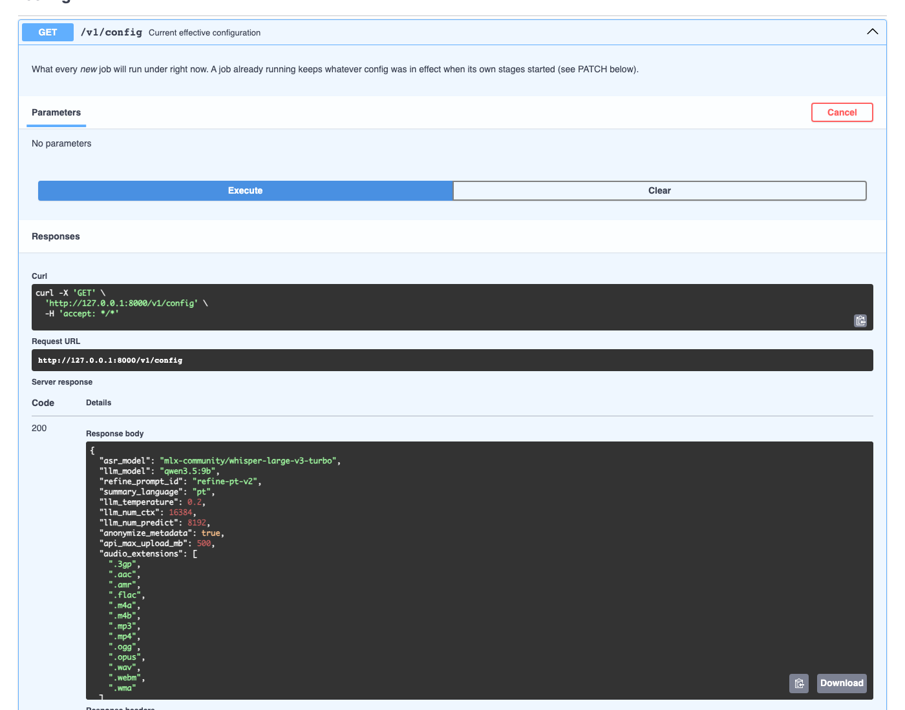

Returns the actual effective config — `asr_model`, `llm_model`, `refine_prompt_id: "refine-pt-v2"`, `summary_language: "pt"`, real numeric values for `llm_temperature`/`llm_num_ctx`/`llm_num_predict`/`api_max_upload_mb`, and the full `audio_extensions` list. This is real, not a stub — the frontend's own model labels (ASR/LLM) match this response one-to-one.

### Bugs found in Part 1

**Bug 1 (real, reproducible) — Every non-2xx response shows the same misleading example, regardless of actual status code.**

The shared `Problem` schema (used by nearly every error response across the whole API) carries one hardcoded example baked directly into the schema definition:

```json
{
  "detail": "no such job: deadbeef",
  "instance": "/v1/jobs/deadbeef",
  "status": 404,
  "title": "Not Found",
  "type": "about:blank"
}
```

Swagger UI applies this same example to *every* response `$ref`-ing `Problem`, no matter what that response actually means. Concretely:

- `POST /v1/jobs` → `400 Unsupported audio file extension` shows the *404 "no such job"* example, not a 400 example.
- `POST /v1/jobs` → `413 Upload exceeds the configured size limit` shows the same *404 "no such job"* example.

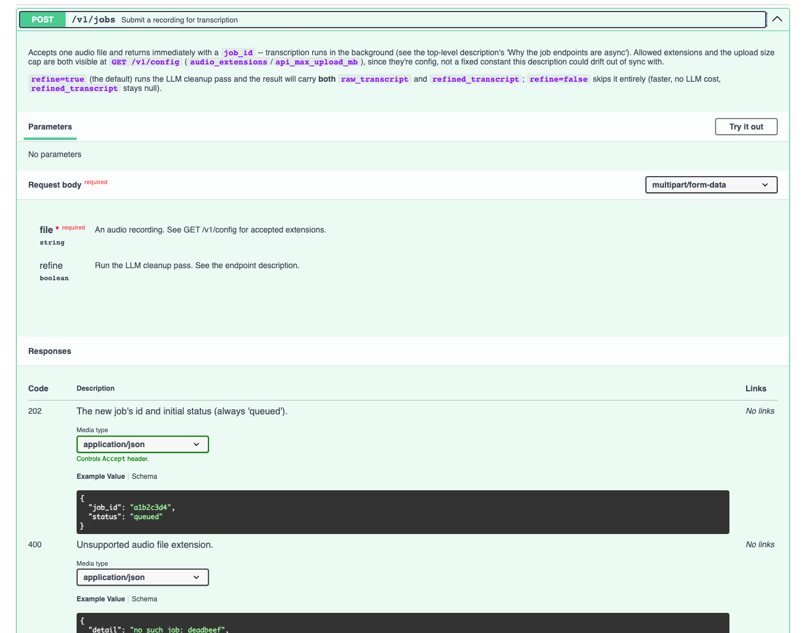

**To reproduce:** open `/docs` → expand `POST /v1/jobs` → scroll to Responses → look at the `400` and `413` example bodies. Both read `"detail": "no such job: deadbeef"`, `"status": 404`, `"title": "Not Found"` — content that has nothing to do with a bad extension or an oversized upload. The only response where this example happens to be correct is one that's genuinely a 404 (e.g. `GET /v1/jobs/{job_id}` → `404`).

A newcomer trying to write error-handling code against the 400/413/409 cases would copy a completely wrong example body. Fix: give the `Problem` schema per-response `examples` overrides (OpenAPI supports `examples` at the response/media-type level, which take precedence over the schema-level example) instead of one shared schema example.

**Bug 2 (real, reproducible) — `GET /v1/jobs/{job_id}/docx` 200 response looks like it returns JSON.**

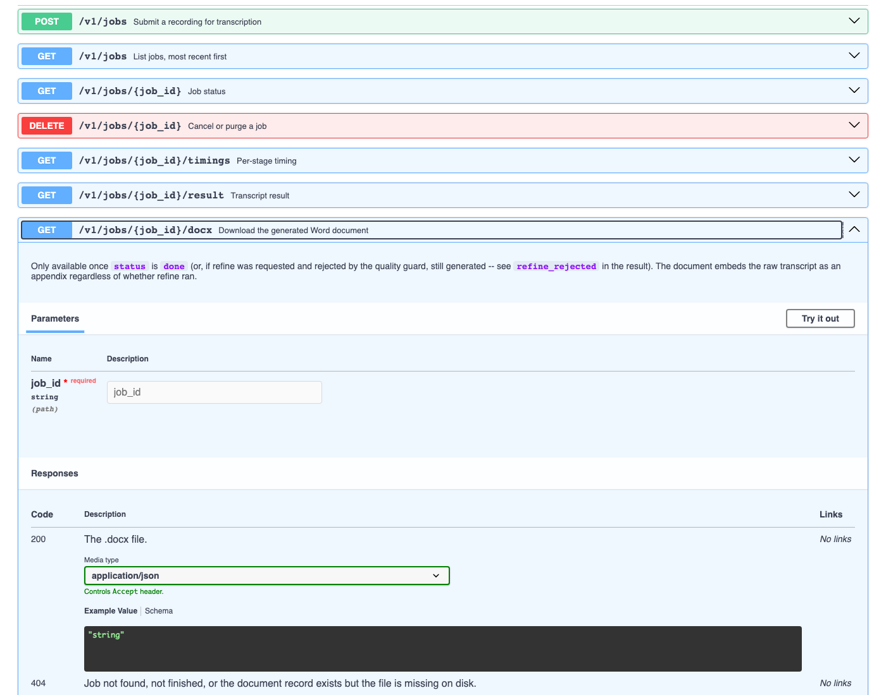

The 200 response declares two content types: the correct `application/vnd.openxmlformats-officedocument.wordprocessingml.document` (with no example, since it's binary), and an extra `application/json` entry with an empty schema (`{}`). Swagger UI defaults its media-type dropdown to `application/json` and, because the schema is empty, fabricates a bogus `"string"` example. A newcomer reading only the rendered docs (not the raw OpenAPI JSON) would reasonably conclude this endpoint returns a JSON string, when it actually streams a `.docx` file (confirmed — downloading it in the frontend produces a real, valid 37KB Word document).

**To reproduce:** open `/docs` → expand `GET /v1/jobs/{job_id}/docx` → Responses → 200 → the "Media type" dropdown defaults to `application/json` showing Example Value `"string"`. Fix: drop the stray empty `application/json` content entry from that response's OpenAPI definition (likely coming from FastAPI's default `response_model` inference colliding with a manually-specified `responses={}` override).

### Minor / polish notes (Part 1)

- The `Problem` schema's declared media type in the OpenAPI spec is `application/json` for every error response, even though the server (verified via `curl -D -`) correctly sends `Content-Type: application/problem+json` at runtime, matching the top-level docs text. This is a spec-vs-runtime mismatch — cosmetic only (Swagger UI's "Media type" label is technically wrong), but worth tidying since the docs explicitly call out `application/problem+json` as the contract.
- `benchmark` tag description references `PLAN.md` (an internal repo file, not part of the public API surface) — reads oddly out of context for anyone reading `/docs` without repo access.

---

## Part 2 — Streamlit frontend (`http://127.0.0.1:8501`)

### Sidebar / initial state

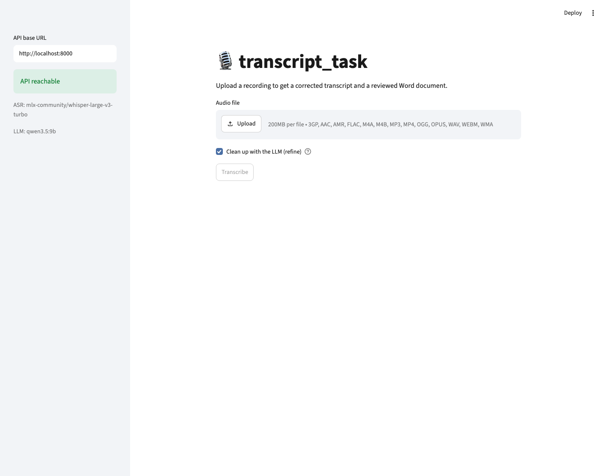

Sidebar shows **"API reachable"** in green, plus real model names pulled live from the API: `ASR: mlx-community/whisper-large-v3-turbo` and `LLM: qwen3.5:9b` — both match `GET /health` and `GET /v1/config` exactly. The upload widget correctly states the real constraints from config: "200MB per file • 3GP, AAC, AMR, FLAC, M4A, M4B, MP3, MP4, OGG, OPUS, WAV, WEBM, WMA" (matches the `api_max_upload_mb`/`audio_extensions` values seen in `/v1/config`).

### End-to-end run — short clip (`fleurs_row00871.wav`, ~4s)

Uploaded the file, checked "Clean up with the LLM (refine)" (default-on), clicked **Transcribe**. The button correctly disables and shows a bike-icon "running" indicator in the top-right while a job is in flight.

Live progress observed, in order, with the progress bar advancing at each step and the status text updating in sync:

`normalizing` → `transcribing` → `refining` → `summarizing` → `writing_docx` → `done`

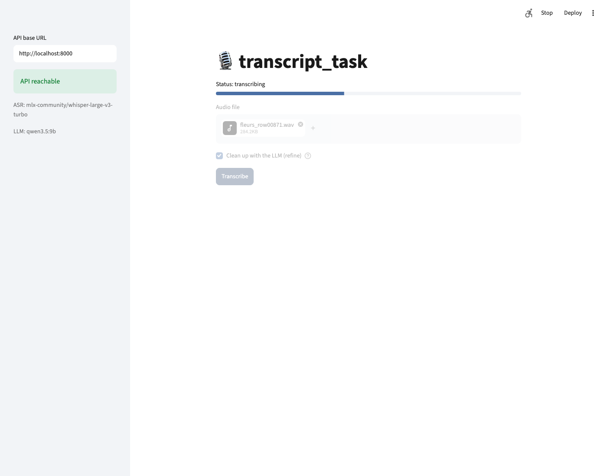
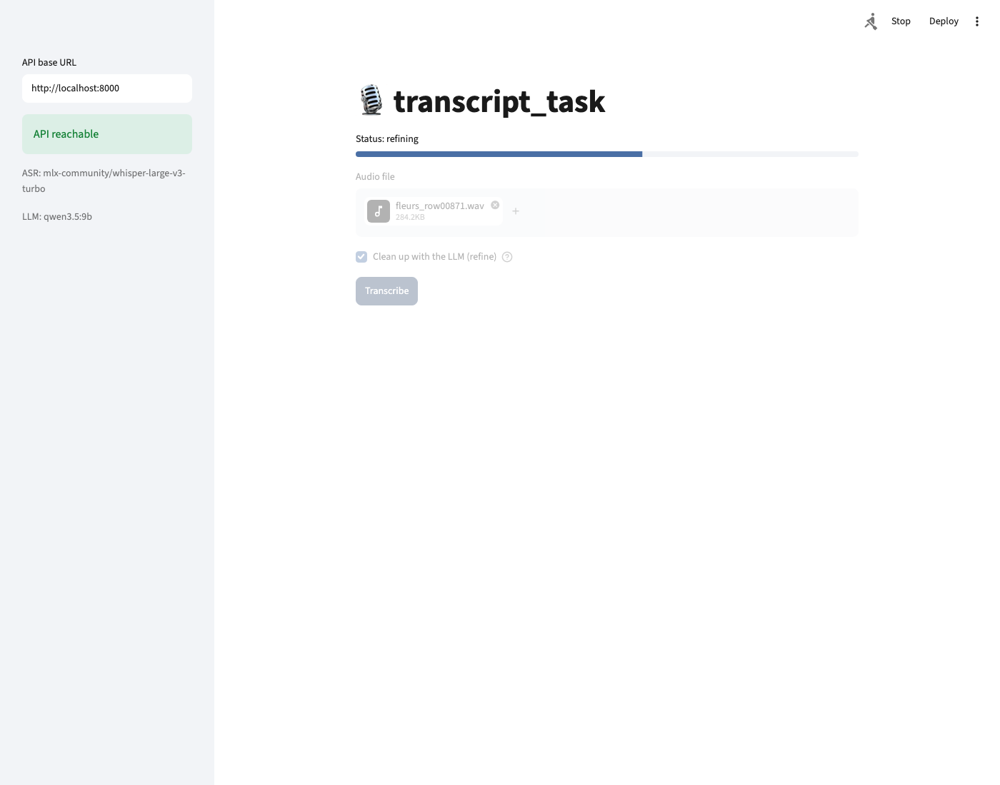

Total wall-clock time for this run: **~28–38 seconds** across repeated runs (varies run to run — expected, since it includes live LLM calls). No stalls, no stuck progress bar, no stage skipped.

### Result screen

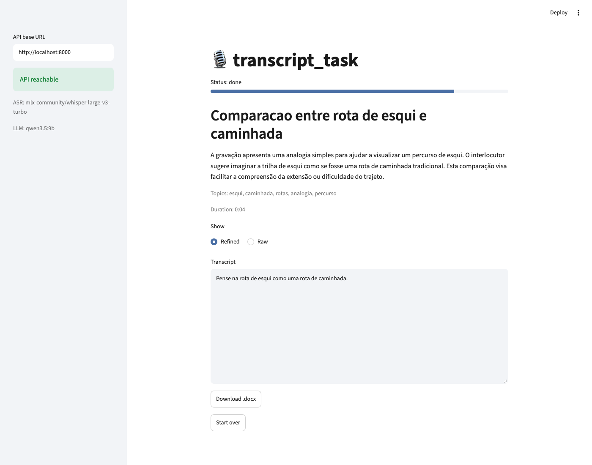

- **Title & description**: generated and displayed (`"Comparacao entre rota de esqui e caminhada"` / a full paragraph summary in Portuguese) — see **Bug 3** below re: the title's missing accent.
- **Topics**: a comma-separated tag list (`esqui, caminhada, rotas, analogia, ...`).
- **Duration**: `0:04`, correct for this fixture.
- **Raw/Refined toggle**: confirmed working — clicking **Raw** genuinely flips the radio selection and re-renders the transcript textarea (checked via `.input_value()` on the underlying `<textarea>`, not just visually):

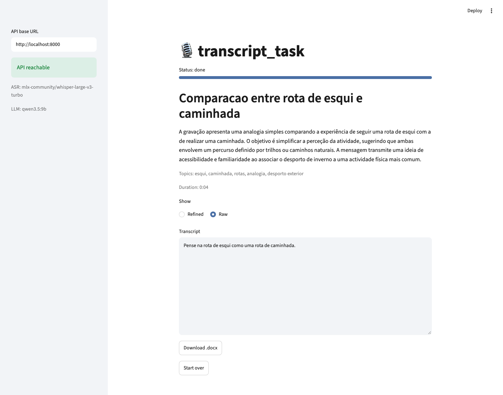

  For this specific short clip, the raw and refined text were byte-identical (`"Pense na rota de esqui como uma rota de caminhada."`) both times it was run — plausible, since the ASR output for a single short clean sentence needs no LLM cleanup. Confirmed this isn't a toggle bug by checking the longer clip below, where raw/refined text does differ (the LLM adds punctuation, expands "USGS" context, etc. — visible directly in the transcript box).
- **Sensitivity warning banner**: did not appear for either test clip. Checked the raw API result (`GET /v1/jobs/{id}/result`) directly — both jobs reported `"sensitivity": "low"`, so the banner correctly stayed hidden; this is expected behavior for benign travel/geology content, not something this session could force without adversarial input.
- **Download .docx**: clicked the real button (not simulated) — triggered a genuine browser download of a 37,626-byte `.docx` file named after the source audio (`fleurs_row00871.docx`). Confirmed non-empty, real file.
- **Start over**: clicked it — the app correctly reset to the blank upload screen (upload widget, "Clean up with the LLM" checkbox, and a disabled "Transcribe" button all reappeared exactly as on first load).

### End-to-end run — long clip (`fleurs_row00099.opus`, ~37s)

Same flow, same stage sequence, completed in ~27s wall-clock this run.

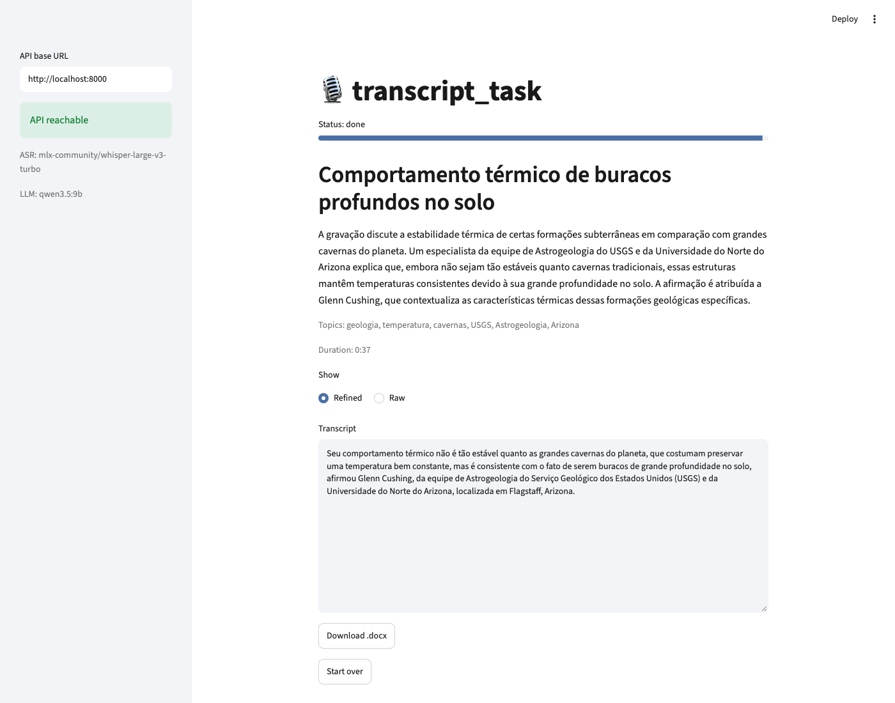

- Title this time: **"Comportamento térmico de buracos profundos no solo"** — accents render correctly (`térmico`).
- Raw vs. refined text differ here — the refined version is properly punctuated with capitalization/place names cleaned up ("Flagstaff, Arizona" etc.), confirming the toggle is pulling genuinely distinct content, not just relabeling the same string.
- Per-stage timings from `GET /v1/jobs/{id}/timings` for this run: `transcribe: 2.14s`, `refine: 7.73s`, `summarize: 15.42s`. (`normalize` and `writing_docx` aren't tracked in the timings payload — presumably fast enough not to be worth recording, or bundled elsewhere; not something visible as a UI issue.)

### Error case — unreachable API base URL

Changed the sidebar "API base URL" field to `http://localhost:9999` (nothing listening there).

**Sidebar immediately reflects the failure, no crash:**

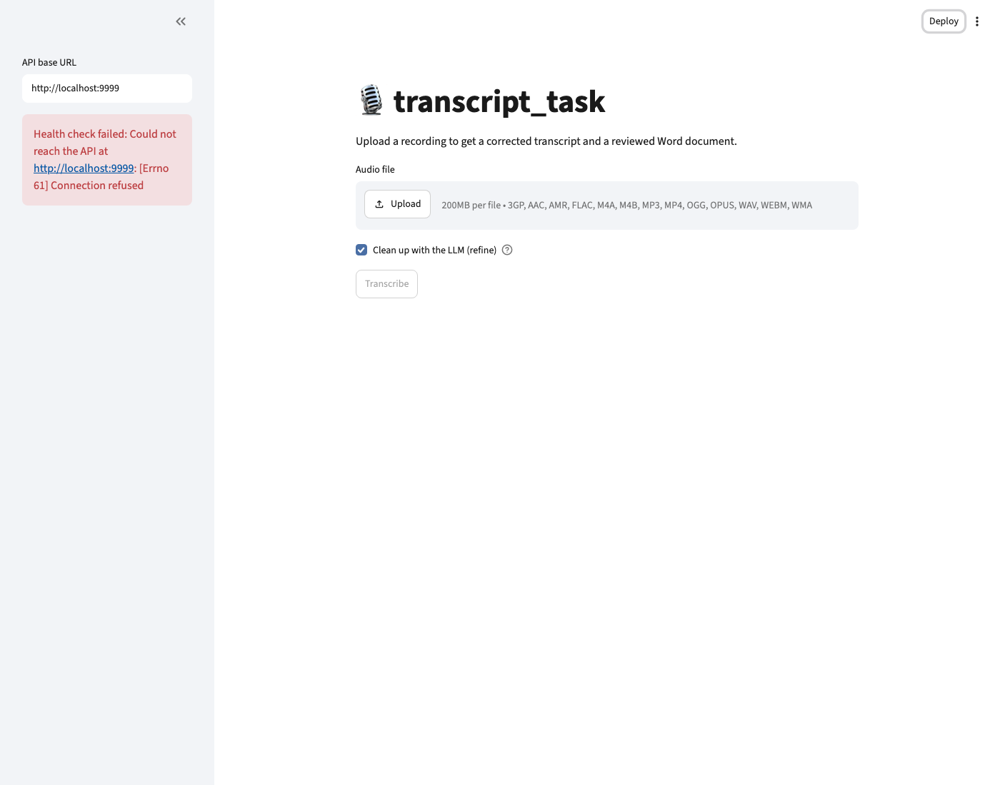

> Health check failed: Could not reach the API at http://localhost:9999: [Errno 61] Connection refused

**Then uploaded a file and clicked Transcribe anyway (the button is not disabled when the API is unreachable) — submission fails with an equally clean, readable error, again no traceback:**

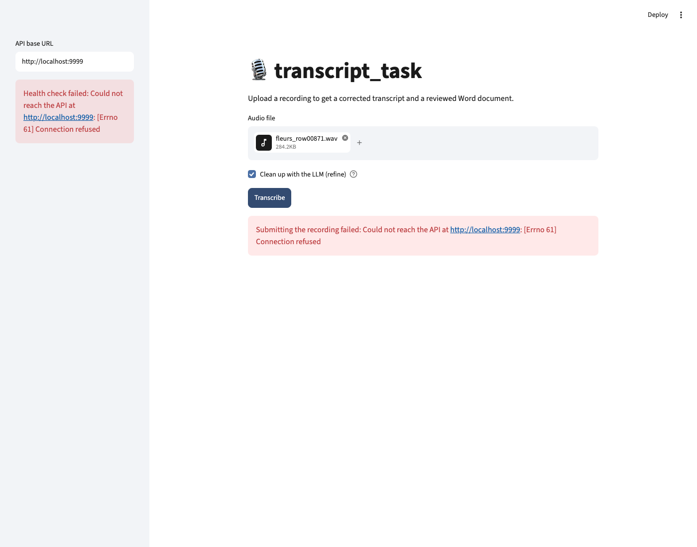

> Submitting the recording failed: Could not reach the API at http://localhost:9999: [Errno 61] Connection refused

Both error states render as a plain red Streamlit alert box with a human-readable message — no Python traceback, no raw exception text, no blank/crashed page. This is solid, deliberate error handling.

### Bugs found in Part 2

**Bug 3 (minor, content-quality, not clearly an app bug) — Generated title occasionally drops Portuguese diacritics while the description does not.**

For the short clip (`fleurs_row00871.wav`), across 3 separate runs, the generated title was consistently **"Comparacao entre rota de esqui e caminhada"** (missing the cedilla — should be "Comparação"), while the description field in the same response correctly used proper accents throughout ("comparação", "atividade", "acessibilidade"). Verified this is not a display artifact — the raw JSON from `GET /v1/jobs/{id}/result` has the same unaccented string in `summary.title`.

However, the longer clip's title ("Comportamento térmico de buracos profundos no solo") rendered its accent (`térmico`) correctly, so this isn't a systemic "titles always strip accents" bug — it reproduced 3/3 times for this one specific short clip's title only. Likely an LLM-generation quirk tied to that specific word/prompt rather than a sanitization bug in the app. Flagging as a data-quality observation rather than a hard bug, since it's not clearly fixable in app code (would need prompt tuning or a normalization pass), but worth a look if consistent title quality matters.

### Minor / polish notes (Part 2)

- The "Transcribe" button stays enabled even when the sidebar shows "Health check failed" for the configured API URL — a newcomer might expect it to grey out until the API is reachable again, rather than allowing the click-and-fail round trip. Not broken (the resulting error message is clear), just a small UX opportunity.
- The `?` tooltip icon next to "Clean up with the LLM (refine)" was not explored in this pass — worth a quick check that its hover/click content is informative, since it's the only inline help affordance in the UI.

---

## Part 3 — Frontend aesthetic recommendations

The functional walkthrough above confirms the app *works*; it doesn't say anything about how it *looks*. Looking back at the screenshots in Part 2, the frontend is visually plain: default Streamlit widget chrome, a centered single column, plain black text on white, a generic blue progress bar, and a flat stack of `st.title`/`st.write`/`st.text_area` calls with no visual separation between sections. This is by design, not neglect — `frontend/app.py`'s own docstring calls it "a deliberately minimal single-screen flow... following Streamlit's own standard upload-and-process idiom," and `.streamlit/config.toml` already sets a small custom palette (`primaryColor = "#4A6FA5"`, a soft blue) on top of Streamlit's defaults. But "minimal" and "polished" aren't the same thing, and right now it reads as the former only.

To ground the recommendations below in something more concrete than opinion, I researched what actually separates a "beautiful" Streamlit app from a default one.

### What the research found

**1. Streamlit's own native theming system goes much further than this app currently uses.** The `[theme]` table in `config.toml` supports far more than the four keys currently set. Per the [official config.toml reference](https://docs.streamlit.io/develop/api-reference/configuration/config.toml), the full set includes:

- Separate **`headingFont`** and **`codeFont`**, plus `baseFontSize`/`baseFontWeight` and per-heading-level size/weight arrays — right now every heading and body line uses the same default sans-serif at default weight.
- **`baseRadius`** and **`buttonRadius`** for corner rounding (sharp-cornered widgets read as more "generic," rounded ones read as more modern/friendly).
- **`showWidgetBorder`** / **`showSidebarBorder`** to add visual separation between sections instead of everything floating on the same flat background.
- A full semantic color palette (`redColor`, `greenColor`, `blueColor`, etc. with auto-derived background/text variants) — useful for status indicators like the sensitivity banner or the API-reachable badge, instead of relying only on Streamlit's default `st.success`/`st.warning` green/orange.
- **`[theme.dark]`** as a sibling table to `[theme]`/`[theme.light]` for a real dark mode, not just the single light palette currently defined.
- **`fontFaces`** to load a custom Google Font/self-hosted font by URL, which is the single biggest lever for making a Streamlit app stop looking like "a Streamlit app."

**2. Ready-made professional themes exist and are drop-in.** [awesome-streamlit-themes](https://github.com/jmedia65/awesome-streamlit-themes) packages 10 complete `config.toml` + font-file themes (Healthcare, Financial/Professional, SaaS/Startup, Dark Mode Developer, Material Design, Editorial, etc.) specifically aimed at taking an app from "obviously Streamlit" to polished. For a tool like this — a personal/local speech-to-text utility — the "Developer / Dark Mode" or "SaaS/Startup" theme direction fits better than the current generic light-blue palette.

**3. Layout and structure matter as much as color.** Streamlit's own [design concepts docs](https://docs.streamlit.io/develop/concepts/design) point at columns, containers, tabs, and flex layouts as the tools for turning a vertical wall of text into something with actual visual hierarchy — and the current app uses none of them. Every screen in this app is `st.title` → `st.write` → one widget → one button, stacked top to bottom in a `layout="centered"` column that's mostly whitespace on either side at any modern screen width.

**4. A small ecosystem of component libraries exists specifically to replace default Streamlit widgets with modern-looking equivalents**, without leaving Python:
- [streamlit-shadcn-ui](https://github.com/ObservedObserver/streamlit-shadcn-ui) brings [shadcn/ui](https://ui.shadcn.com)-style components (cards, badges, tabs, buttons) into Streamlit — this is probably the most visually distinctive option available.
- [streamlit-extras](https://extras.streamlit.app/) adds smaller, focused pieces like metric cards, badges, and grid layouts on top of core Streamlit, with less visual departure from the native look.
- [StreamlitAntdComponents](https://github.com/nicedouble/StreamlitAntdComponents) is a similar option built on Ant Design instead of shadcn.

### Recommendations, by effort

**Quick win — expand the existing theme (no new dependencies, ~30 min):**
The app already has a `[theme]` table; it's just underusing it. A more complete version, still using only Streamlit's built-in system:

```toml
[theme]
base = "dark"                  # or keep light — but pick one deliberately and lean into it
primaryColor = "#4A6FA5"
backgroundColor = "#0E1117"
secondaryBackgroundColor = "#1C1F26"
textColor = "#E6E6E6"
font = "sans serif"
headingFont = "sans serif"     # or a fontFaces entry pointing at a Google Font
baseRadius = "1rem"
buttonRadius = "1rem"
showWidgetBorder = true

[theme.sidebar]
backgroundColor = "#161A20"
```

This alone — real border radius, a widget border, and an intentional dark palette instead of "white background plus one accent color" — would change the first impression significantly, and costs nothing but editing a file that already exists.

**Medium effort — restructure the result screen with layout primitives (no new dependencies):**
The result screen (`render_result_screen` in `frontend/app.py`) currently renders title → paragraph → topics caption → duration caption → radio → textarea → button, all in one column. Concretely:
- Switch `st.set_page_config(layout="centered")` to `layout="wide"` and put the transcript in one column and title/summary/topics/duration/download in a second, narrower column — the current centered layout wastes most of the screen on desktop.
- Wrap the summary block in `st.container(border=True)` (native since Streamlit 1.31, `showWidgetBorder` above achieves something similar for widgets) so it reads as a distinct "card" instead of blending into the page.
- Replace the plain `st.caption(f"Duration: ...")` with `st.metric("Duration", format_duration(...))` — metrics get their own typography treatment (large value, small label) for free and would make duration/sensitivity/confidence read as an at-a-glance stats row instead of buried caption text.
- Render `topics` as individual `st.badge()`/pill-style elements (native `st.badge` as of recent Streamlit versions, or via `streamlit-extras`) instead of one comma-joined caption string.
- Replace the six-stage `st.progress` bar's plain text label with a small step indicator (e.g., five or six short labels with the current one highlighted) so a user can see at a glance how far through `normalizing → transcribing → refining → summarizing → writing_docx → done` they are, not just a percentage and the current stage name.

**Bigger effort — adopt a component library for a genuinely different visual identity:**
If the goal is for this to look distinctly designed rather than "a well-configured Streamlit app," `streamlit-shadcn-ui` is the strongest option found: its card, badge, and tab components would let the result screen (title, description, topics, raw/refined switch) be rebuilt as an actual card-based UI instead of stacked native widgets, and its tabs component is a more visually deliberate replacement for the current plain `st.radio("Show", ["Refined", "Raw"])` toggle. This is more work (new dependency, some rewriting of `render_result_screen`/`render_upload_screen`) and worth doing only if visual polish becomes a real priority rather than a nice-to-have for a local personal tool — the theme-config and layout changes above get most of the visible improvement for a fraction of the effort.

**Sources consulted:**
- [Streamlit config.toml reference](https://docs.streamlit.io/develop/api-reference/configuration/config.toml) — full list of `[theme]` keys
- [Streamlit theming concepts](https://docs.streamlit.io/develop/concepts/configuration/theming)
- [Streamlit app design concepts](https://docs.streamlit.io/develop/concepts/design) — layouts, containers, columns
- [awesome-streamlit-themes](https://github.com/jmedia65/awesome-streamlit-themes) — 10 packaged professional themes
- [streamlit-shadcn-ui](https://github.com/ObservedObserver/streamlit-shadcn-ui)
- [streamlit-extras](https://extras.streamlit.app/) / [component docs](https://arnaudmiribel.github.io/streamlit-extras/components/)
- [StreamlitAntdComponents](https://github.com/nicedouble/StreamlitAntdComponents)

---

## Overall verdict

**Both surfaces work correctly end-to-end.** The core golden path — upload real audio → live progress through all 6 stages → transcript + AI summary + downloadable `.docx` → reset — functioned correctly on two different real audio fixtures, with no crashes, no stuck states, and accurate live data everywhere it was checked (health, config, model names, per-stage timings). Error handling for an unreachable API is genuinely good: clear, human-readable messages with no leaked tracebacks, in both the passive (sidebar) and active (submit) failure paths.

The API documentation is unusually well-written in prose — the explanations of *why* things work the way they do (async jobs, the 409 on cancel, the docx/refine_rejected interaction) are well above the norm for auto-generated FastAPI docs. The two concrete bugs found (Bug 1: wrong example bodies on 400/413 responses; Bug 2: docx endpoint's misleading JSON example) are both narrowly-scoped OpenAPI schema issues, not runtime bugs — the actual server behavior is correct in both cases; only the *rendered documentation* is misleading. Both are easy, low-risk fixes.

Visually, the frontend is functional but plain — a deliberate minimal build, not a bug, but worth revisiting if this stops being a personal/local tool. See **Part 3** for concrete, researched recommendations ranging from a 30-minute theme-config expansion to adopting a component library like `streamlit-shadcn-ui`.

**Recommendation:** ship-ready for local/personal use as-is, functionally. Before treating the OpenAPI spec as a contract for other consumers, fix Bug 1 and Bug 2 so the documented examples match reality. If visual polish matters going forward, start with the "quick win" theme-config expansion in Part 3 — it's free and covers most of the visible gap.
